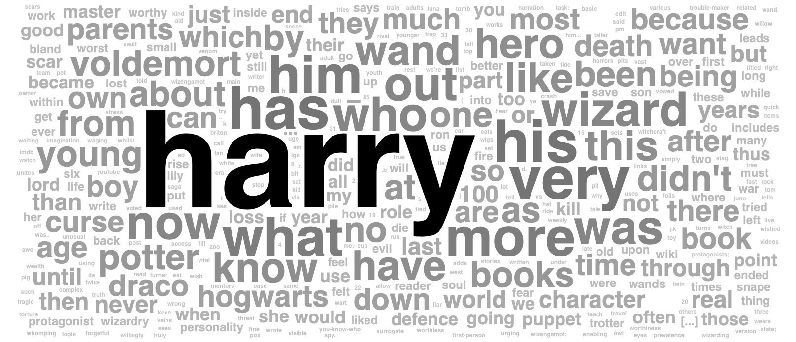

# datorama-d3-word-cloud
Custom widget for Datorama. Creates a classic word cloud.

This custom widget transforms text data in your first dimension into a classic word cloud that counts the number of word ocurrences.

Credit to Jason Davies' excellent [d3-cloud project](https://github.com/jasondavies/d3-cloud) for handling the layout algorithm.



## Preferences
Add this code to the JS section of the Custom Widget Editor.
```
var prefs = {
  'fitAllWords': false, // true (can be very slow), or false (large words will be placed first, so only insignificant words should be left out)
  'removePunc': '\' . , ? … ( ) [ ]',
  'removeWords': 'the and i is that in an be a on with for it’s it to a of \'s',
  'case': 'lower', // 'upper', 'lower', 'proper', or null
  'font': 'sans-serif', // 'serif', 'sans-serif', or named fonts (if a named font shows as serif, then it's unsupported)
  'fontWeight': 'bold', // 'normal' or 'bold'
  'rotation': 0, // words randomly rotated up to this many degrees (90 results in -45° to 45° random rotation)
  'extraPadding': 0 // base word padding is 1 pixel
};
```

Explanations:
* `fitAllWords`: An initial word size factor is calculated based on your data and the size of the widget. If this preference is `false`, the first layout will be used, with large words placed first and small (less used) words placed last, with words removed if there's no space found for them. If this preference is `true`, then the layout process will loop, with the initial word size factor decreasing until all words fit. If you have many words, then a `true` preference can be very slow.
* `removePunc`: A space-separated list of punctuation to remove from your input text. Only punctuation at the start or end of words will be removed. Escape the apostophe character with `\`, as in the example code above.
* `removeWords`: A space-separated list of words to remove from your input text. Case-insensitive. If you have any words separated by punctuation (e.g. it’s and it), list the longer string first. 
* `case`: Basically a word-harmonisation tool, so that "Hello" and "hello" don't get listed separately.

## Common Style Changes
To change the colour of words and the hover colour, addd this to the CSS section of the Custom Widget Editor.
```
.word {
  fill: green;
}

.word:hover {
  fill: blue;
}
```

## Set up and Dependencies
Add `wordCloud.initialize();` to the JS section, and add the below dependencies to the second tab of the Custom Widget Editor.

Script dependencies (must be loaded in this order):
1. `https://d3js.org/d3.v5.min.js`
2. `https://dato-custom-widgets-js-css.s3.eu-west-2.amazonaws.com/word-cloud/d3-cloud.js`
3. `https://dato-custom-widgets-js-css.s3.eu-west-2.amazonaws.com/word-cloud/Word+Cloud.js`

Style dependency:
1. `https://dato-custom-widgets-js-css.s3.eu-west-2.amazonaws.com/word-cloud/Word+Cloud.css`
